# DumbDisplay MicroPython Library (v0.5.1)

DumbDisplay MicroPython Library -- workable with Python 3 -- is a port of the [DumbDisplay Arduino Library](https://github.com/trevorwslee/Arduino-DumbDisplay)
to MicroPython / Python 3 for the [DumbDisplay Android app](https://play.google.com/store/apps/details?id=nobody.trevorlee.dumbdisplay)

For a video introduction, please watch the YouTube video: [Introducing DumbDisplay MicroPython Library -- 
with ESP32, Raspberry Pi Pico, and Raspberry Pi Zero](https://www.youtube.com/watch?v=KVU26FyXs5M)

Although the porting is still work-in-progress, a large portion of the core of DumbDisplay functionalities have been ported.
Hopefully, this should already be helpful for friends that develop programs for microcontroller boards in MicroPython.

As hinted previously, even DumbDisplay MicroPython Library is originally targeted for MicroPython, it should be useable with regular Python 3, like in Raspberry Pi environment or even with desktop / laptop.
Consequently, DumbDisplay MicroPython Library might be an alternative way to prototype simple Android app driven remotely with Python 3 from desktop / laptop, say for displaying experiment result data and getting simple interactions from the user.


Enjoy

- [DumbDisplay MicroPython Library (v0.5.0)](#dumbdisplay-micropython-library-v050)
- [Installation](#installation)
- [Getting Started](#getting-started)
- [More Details](#more-details)
  - [IO Mechanism](#io-mechanism)
  - [Layers](#layers)
  - [Auto-Pinning of Layers](#auto-pinning-of-layers)
  - [Feedbacks of Layers](#feedbacks-of-layers)
    - [Poll for Feedback](#poll-for-feedback)
    - [Callback for Feedback](#callback-for-feedback)
- [Selected Demos](#selected-demos)
- [Notes](#notes)
- [Thank You!](#thank-you)
- [License](#license)
- [Change History](#change-history)


# Installation

For MicroPython, please refer to the [above-mentioned YouTube video](https://www.youtube.com/watch?v=KVU26FyXs5M)
for examples of using DumbDisplay MicroPython Library for microcontroller programming.

If your targeted is desktop / laptop, you can install the package like:
```
pip install git+https://github.com/trevorwslee/MicroPython-DumbDisplay
```

>
> If you would like to try out the development version (for desktop / laptop), you can install the development version like:
> ```
> pip install --upgrade --force-reinstall git+https://github.com/trevorwslee/MicroPython-DumbDisplay@develop
> ```
> 
> To switch back after trying the development version, run
> ```
> pip install --upgrade --force-reinstall git+https://github.com/trevorwslee/MicroPython-DumbDisplay
> ```
>


# Getting Started

To use DumbDisplay MicroPython Library, the basic Python script setup is:

1. Import core components, for creating `DumbDisplay` object
   <br>e.g.
   ```
   from dumbdisplay.core import *
   dd = DumbDisplay()
   ```
   - you can import the core components with ```from dumbdisplay.core import *```
   - or you can choose to import all components (including layers to be mentioned later) with ```from dumbdisplay.full import *```

2. Import IO mechanism, for creating IO object [to pass to DumbDisplay object] like
   <br>e.g.
   ```
   from dumbdisplay.core import *
   from dumbdisplay.ios import *
   dd = DumbDisplay(io=io4Wifi("ssid", "password")) # the default is io4Inet()
   ```
   - the default `io` is `io4Inet()`, which uses Python networking support (not available for MicroPython)

3. Import layer, for creating layer object [passing DumbDisplay object to it]
    <br>e.g.
    ```
    from dumbdisplay.core import *
    from dumbdisplay.layer_ledgrid import *
    dd = DumbDisplay()
    l = LayerLedGrid(dd)
    ```
   - you can choose to import all types of layers with ```from dumbdisplay.full import *```
     

# More Details

## IO Mechanism

When create a `DumbDisplay` object, an IO object is needed
- `io4Inet` (the default) -- Python networking support (not available for MicroPython)
- `io4Wifi` -- MicroPython WiFi support (for Raspberry Pi Pico W, ESP32, etc.)
- `io4Uart` -- MicroPython UART support (for Raspberry Pi Pico W, ESP32, etc.)
- `io4Ble` -- MicroPython BLE support (for ESP32, etc.)

E.g.
```
from dumbdisplay.core import *
from dumbdisplay.ios import *
dd = DumbDisplay(io4Wifi("ssid", "password"))
```

## Layers

Other then the `DumbDisplay` object, you will need to create one or more layer objects to represent the visible portion of the UI:

- `LayerLedGrid` -- a single LED, or a row / column / grid of multiple LEDs (**n** columns by **m** rows)
  ```
  from dumbdisplay.core import *
  from dumbdisplay.layer_ledgrid import *
  dd = DumbDisplay()
  l = LayerLedGrid(dd)
  ```
  example:
  |[`demo_LayerLedGrid()` in `dd_demo.py`](dd_demo.py)|
  |:--:|
  |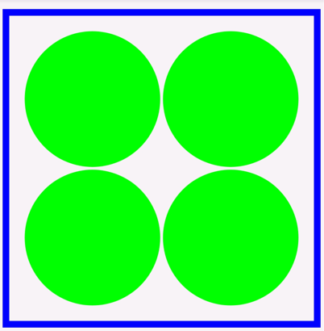</img>|

- `LayerLcd` -- a TEXT based LCD with configurable number of lines of configurable number of characters
  ```
  from dumbdisplay.core import *
  from dumbdisplay.layer_lcd import *
  dd = DumbDisplay()
  l = LayerLcd(dd)
  ```
  
  example:
  |[`demo_LayerLcd()` in `dd_demo.py`](dd_demo.py)|
  |:--:|
  |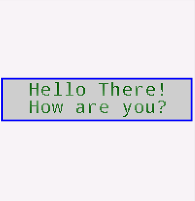</img>|

- `LayerGraphical` -- a graphical LCD that you can draw to with common TFT LCD drawing directives
  ```
  from dumbdisplay.core import *
  from dumbdisplay.layer_graphical import *
  dd = DumbDisplay()
  l = LayerGraphical(dd)
  ```
  
  example:
  |[`demo_LayerGraphical()` in `dd_demo.py`](dd_demo.py)|
  |:--:|
  |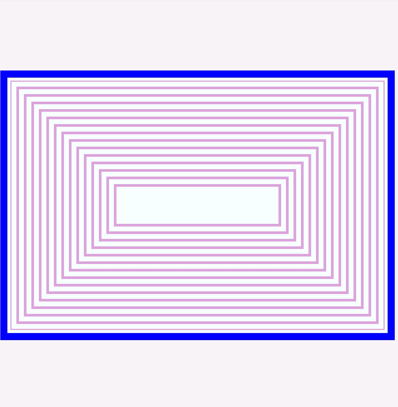</img>|

- `Layer7SegmentRow` -- a single 7-segment digit, or a row of **n** 7-segments digits
  ```
  from dumbdisplay.core import *
  from dumbdisplay.layer_7segrow import *
  dd = DumbDisplay()
  l = Layer7SegmentRow(dd)
  ```
  
  example:
  |[`demo_Layer7SegmentRow()` in `dd_demo.py`](dd_demo.py)|
  |:--:|
  |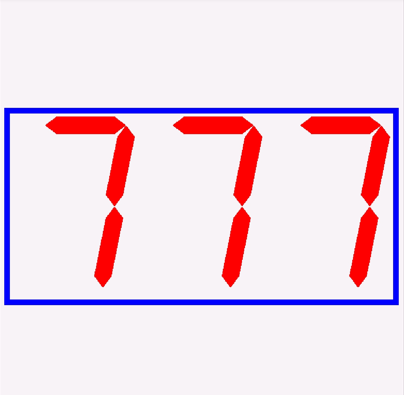</img>|
- 
- `LayerTurtle` -- a Python Turtle like canvas that you can draw to using Python Turtle like commands
  ```
  from dumbdisplay.core import *
  from dumbdisplay.layer_turtle import *
  dd = DumbDisplay()
  l = LayerTurtle(dd)
  ```

  example:
  |[`demo_LayerTurtle()` in `dd_demo.py`](dd_demo.py)|
  |:--:|
  |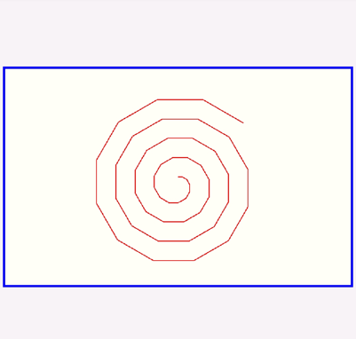</img>|


- `LayerSelection` -- a row / column / grid of TEXT based LCDs mostly for showing selection choices
  ```
  from dumbdisplay.core import *
  from dumbdisplay.layer_selection import *
  dd = DumbDisplay()
  l = LayerSelection(dd)
  ```

  example:
  |[`demo_LayerSelection()` in `dd_demo.py`](dd_demo.py)|
  |:--:|
  |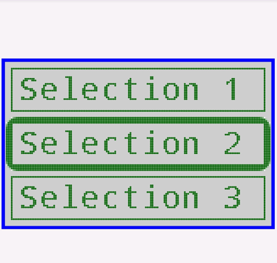</img>|


- `LayerPlotter` -- a "plotter" for plotting real-time data
  ```
  from dumbdisplay.core import *
  from dumbdisplay.layer_plotter import *
  dd = DumbDisplay()
  l = LayerPlotter(dd)
  ```
  
  example:
  |[`demo_LayerPlotter()` in `dd_demo.py`](dd_demo.py)|
  |:--:|
  |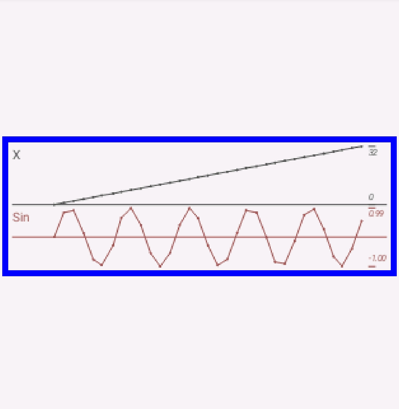</img>|
  
  as shown in th example, two types of data are fed to the plotter -- `X` and `Sin`
  ```
  l.label("X", sin="Sin")
  ```
  And the real-time values of `X` and `Sin` are fed like
  ```
  for x in range(1000):
    sin = math.sin(x)
    l.set(x, sin=sin)
    time.sleep(0.8)
  ```

- `LayerJoystick` -- a joystick; also can be a horizontal or vertical slider 
  ```
  from dumbdisplay.core import *
  from dumbdisplay.layer_joystick import *
  dd = DumbDisplay()
  l = LayerJoystick(dd)
  ```
  
  |[`demo_LayerJoystick()` in `dd_demo.py`](dd_demo.py)|
  |:--:|
  |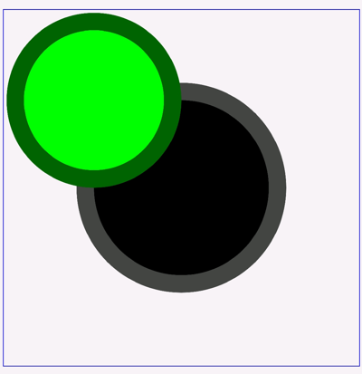</img>|  
  
  as shown in the example
  * you can configure the joystick to be a horizontal or vertical slider by changing the `directions` parameter to `LayerJoystick`
    - param `maxStickValue`: the max value of the stick; e.g. 255 or 1023 (the default); min is 15
    - param `directions`: "lr" or "hori": left-to-right; "tb" or "vert": top-to-bottom; "rl": right-to-left; "bt": bottom-to-top;
                          use "+" combines the above like "lr+tb" to mean both directions; "" the same as "lr+tb"
  * feedback -- to be talked about later -- is enabled by default, and you can poll for feedback like
    ```
    while True:
      fb = l.getFeedback()
      if fb:
        print(f"* Feedback: {fb.type} at ({fb.x}, {fb.y})")
    ```

## Auto-Pinning of Layers

In case of multiple layers, you can "auto pin" them together; otherwise, multiple layers will be stacked on top of each other
```
AutoPin('V', AutoPin('H', l_ledgrid, l_lcd), AutoPin('H', l_selection, l_7segmentrow), l_graphical).pin(dd)
```

Example:
|[`demo_AutoPin()` in `dd_demo.py`](dd_demo.py)|
|:--:|
|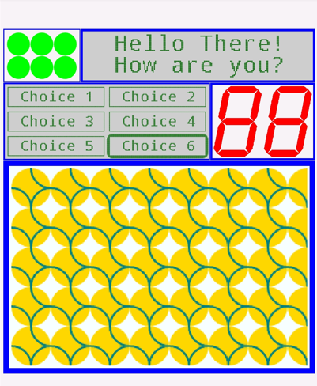</img>|

## Feedbacks of Layers

Certain user interaction, like pressing, with the layers (the UI) can trigger feedback to the corresponding layer objects 

Given a layer `l`, normally you enable feedback like
```
l.enable_feedback()
```
or to enable feedback with auto flashing (UI feedback) of the layer by provide options like `"fl"` like
```
l.enable_feedback("fl")
```

There are two ways feedback of a layer can be received -- polling or callback
 
### Poll for Feedback

After creating the layer, a loop can be implemented to poll for feedback like
```
while True:
  fb = l.getFeedback()
  if fb:
      print(f"* Feedback: {fb.type} at ({fb.x}, {fb.y})")
```
- fb is of type `DDFeedback`
- `DDFeedback.type`: the type of feedback, like `"click"`, `"doubleclick"`, `"longpress"`
- `DDFeedback.x`, `DDFeedback.y`: the "coordinates" of the feedback
  <br>Here, what "coordinates" refers to depends on the type of layer
  * E.g, for `LayerLedGrid`,  "coordinates" refers to which LED
  * E.g, for `LayerGraphical`,  "coordinates" refers to the pixel coordinates
  * E.g, for `LayerSelection`,  "coordinates" refers to which selection

Please take [`demo_Feedback()` in `dd_demo.py`](dd_demo.py) as an example.

### Callback for Feedback

When enabling the layer for feedback, a  callback / handler can be supplied like
```
l.enableFeedback("fa", feedback_handler=lambda layer, type, x, y: print(f"* Feedback: {type} at ({x}, {y})"))
```
The parameters passed to the callback `lambda`:
- `layer`: the layer object that received the feedback
- `type`: the type of feedback (as mentioned above)
- `x`, `y`: the "coordinates" of the feedback (as mentioned above)

***Important*** note: Since DumbDisplay is "cooperative", you should give "time-slices" for DumbDisplay to process feedback signals from the Android app, like:
```
while True:
    dd.timeslice()
```

Please take [`demo_Feedback_callback()` in `dd_demo.py`](dd_demo.py) as an example.


# Selected Demos

Here are two Raspberry Pi Pico PIO demos

|[Respberry Pi Pico W Generating Tones With Programmable I/O (PIO) Using MicroPython](https://www.instructables.com/Respberry-Pi-Pico-W-Generating-Tones-With-Programm/)|[Respberry Pi Pico W NeoPixels Experiments With Programmable I/O (PIO) Using MicroPython](https://www.instructables.com/Respberry-Pi-Pico-W-NeoPixels-Experiments-With-Pro/)|
|--|--|
|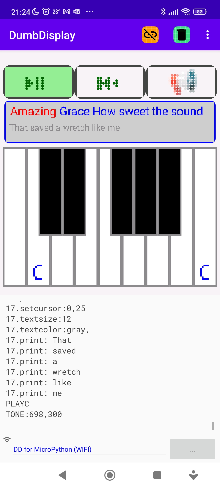|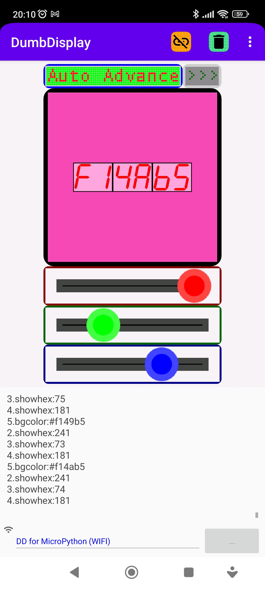|


[`PyTorchIntroductoryExperiments`](https://github.com/trevorwslee/PyTorchIntroductoryExperiments) shows two regular Python 3 demos

|||
|--|--|
|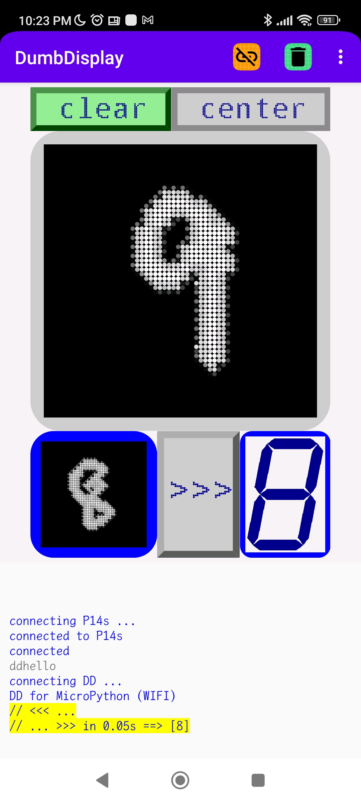|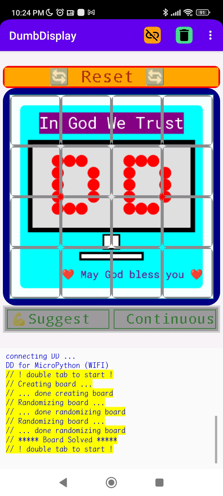|


# Notes
* If seeing ESP32 brownout detection issue, try 
    ```
    import machine
    machine.reset_cause()
    ```
* If DumbDisplay Android app fails to make connection to desktop / laptop, check your desktop firewall settings; try switching desktop WIFI to use 2.4 GHz.


# Thank You!

Greeting from the author Trevor Lee:

> Peace be with you!
> May God bless you!
> Jesus loves you!
> Amazing Grace!


# License

MIT


# Change History

v0.5.1
- added DDRootLayer
- added LayerTurtle
- bug fixes

v0.5.0
- ported "level options" for LayerGraphical 
- ported LayerSelection
- added dumbdisplay_examples package
- bug fixes

v0.3.1
- ported LayerJoystick

v0.3.0
- checked Raspberry Pi Pico W WIFI support
- ported more options from Arduino DumbDisplay library
- bug fixes

v0.2.1
- ported LayerPlotter
- ported "layer margin"
- bug fixes


